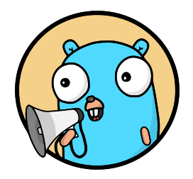

---
hide:
  - navigation
  - toc
---
<!-- markdownlint-disable -->
<h1 style="font-size: clamp(3rem, 8vw, 5rem); text-align: center; margin-bottom: 0;">Shoutrrr</h1>

  

  A Go-based notification library for gophers and their furry friends.
  Heavily inspired by <a href="https://github.com/caronc/apprise" target="_blank">Apprise</a>.

 

Used by the following noteworthy projects:
<ul style="margin-left: 0">
  <li><a href="https://github.com/nicholas-fedor/watchtower" target="_blank">Watchtower</a> - Solution for automating Docker container image updates.</li>
  <li><a href="https://github.com/empowerists/beszel" target="_blank">Beszel</a> - Server monitoring platform with historical data, Docker stats, and alerts.</li>
  <li><a href="https://github.com/aceberg/WatchYourLAN" target="_blank">WatchYourLAN</a> - Network IP scanner for notifying about new hosts and monitoring host connectivity.</li>
  <li><a href="https://github.com/StackExchange/dnscontrol" target="_blank">dnscontrol</a> - Infrastructure as code for DNS.</li>
  <li><a href="https://github.com/offen/docker-volume-backup" target="_blank">docker-volume-backup</a> - Backup Docker volumes locally or to any S3, WebDAV, Azure Blob Storage, Dropbox, Google Drive or SSH compatible storage.</li>
  <li><a href="https://github.com/tphakala/birdnet-go" target="_blank">BirdNET-Go</a> - An AI solution for continuous avian monitoring and identification.</li>
</ul>

<!-- markdownlint-restore -->
