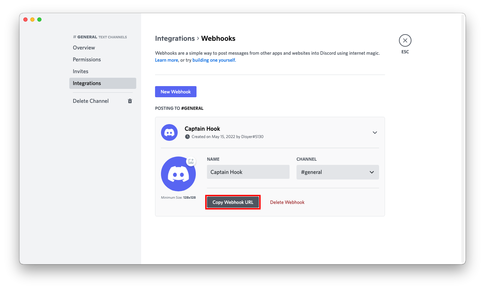

# Discord

## URL Format

Your Discord Webhook-URL will look like this:

!!! info ""
    <https://discord.com/api/webhooks/__`webhookid`__/__`token`>__

For more information about Discord webhooks, see the [official documentation](https://discord.com/developers/docs/resources/webhook).

The shoutrrr service URL should look like this:

!!! info ""
    discord://__`token`__@__`webhookid`__[?thread_id=__`threadid`__]

### Thread Support

To send messages to a specific thread in a Discord channel, include the `thread_id` query parameter in the service URL with the ID of the target thread. For example:

!!! info ""
    discord://__`token`__@__`webhookid`__?thread_id=123456789

You can obtain the `thread_id` by right-clicking a thread in Discord and selecting "Copy ID" (requires Developer Mode to be enabled in Discord settings). For more details on threads, see Discord's [thread documentation](https://discord.com/developers/docs/resources/channel#thread-object). Learn how to enable Developer Mode in Discord's [support article](https://support.discord.com/hc/en-us/articles/206346498-Where-can-I-find-my-User-Server-Message-ID-).

## Webhook Customization

You can customize the webhook's appearance by overriding the default username and avatar that were set when creating the webhook.

!!! example "Custom Username and Avatar"
    ```bash
    shoutrrr send --url "discord://token@webhookid?username=MyBot&avatar=https://example.com/avatar.png" --message "Hello from custom bot!"
    ```

## Message Content

For simple text messages without embeds, Shoutrrr now uses Discord's `content` field directly, providing cleaner message formatting and better compatibility with Discord's features.

!!! example "Simple Text Message"
    ```bash
    shoutrrr send --url "discord://token@webhookid" --message "Hello, World!"
    ```

    This sends a plain text message using the `content` field instead of an embed.

## Message Chunking

Shoutrrr automatically handles long messages by splitting them into multiple chunks when they exceed Discord's character limits. Messages are split at appropriate boundaries to avoid breaking words or formatting.

- __Chunk Size__: Maximum 2000 characters per message
- __Total Size__: Maximum 6000 characters total across all chunks
- __Max Chunks__: Up to 10 message chunks per send operation

When `splitLines` is enabled (default), each line of the input becomes a separate embedded item. When disabled, long messages are automatically chunked to fit within Discord's limits.

!!! example "Long Message Chunking"
    ```bash
    shoutrrr send --url "discord://token@webhookid?splitLines=false" --message "This is a very long message that will be automatically split into multiple chunks if it exceeds Discord's 2000 character limit per message."
    ```

!!! note ""
    Message chunking only applies when `splitLines` is set to `false`. When `splitLines` is `true` (default), each line becomes a separate embed instead.

## Enhanced Embeds

Shoutrrr supports rich embed formatting with authors, images, thumbnails, and custom fields when using the Go library API. Embeds are automatically created when using structured message items with metadata. For detailed information about embed objects, refer to Discord's [embed documentation](https://discord.com/developers/docs/resources/channel#embed-object).

!!! note ""
    Enhanced embed features are only available through the Go library API using `SendItems` with `MessageItem` structs containing metadata. The CLI does not support embed parameters.

## File Attachments

Shoutrrr supports attaching files to your Discord messages when using the Go library. Files are sent as multipart/form-data along with the message payload. See Discord's [webhook execution documentation](https://discord.com/developers/docs/resources/webhook#execute-webhook) for details on file attachments.

!!! note ""
    File attachments require the webhook to have appropriate permissions, and files must be accessible from the system running Shoutrrr. File attachments are not supported in the CLI.

--8<-- "docs/services/chat/discord/config.md"

## Creating a webhook in Discord

1. Open your channel settings by first clicking on the gear icon next to the name of the channel.


2. In the menu on the left, click on *Integrations*.


3. In the menu on the right, click on *Create Webhook*.


4. Set the name, channel, and icon to your liking and click the *Copy Webhook URL* button.


5. Press the *Save Changes* button.


6. Format the service URL:

```url
https://discord.com/api/webhooks/693853386302554172/W3dE2OZz4C13_4z_uHfDOoC7BqTW288s-z1ykqI0iJnY_HjRqMGO8Sc7YDqvf_KVKjhJ
                                 └────────────────┘ └──────────────────────────────────────────────────────────────────┘
                                     webhook id                                    token

discord://W3dE2OZz4C13_4z_uHfDOoC7BqTW288s-z1ykqI0iJnY_HjRqMGO8Sc7YDqvf_KVKjhJ@693853386302554172?thread_id=123456789
          └──────────────────────────────────────────────────────────────────┘ └────────────────┘ └─────────────────┘
                                          token                                    webhook id           thread id
```
