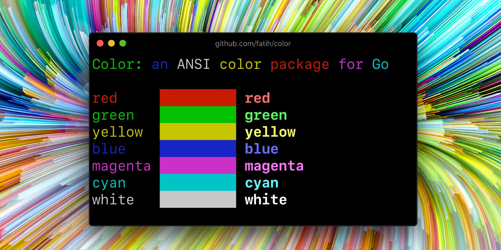

# color

Color lets you use colorized outputs in terms of [ANSI Escape Codes](http://en.wikipedia.org/wiki/ANSI_escape_code#Colors) in Go (Golang). It has support for Windows too! The API can be used in several ways, pick one that suits you.



## Install

```bash
go get github.com/nicholas-fedor/shoutrrr/pkg/color@latest
```

## Examples

### Standard colors

```go
// Print with default helper functions
color.Cyanf("Prints text in cyan.")

// A newline will be appended automatically
color.Bluef("Prints %s in blue.", "text")

// These are using the default foreground colors
color.Redf("We have red")
color.Magentaf("And many others ..")

```

### RGB colors

If your terminal supports 24-bit colors, you can use RGB color codes.

```go
color.RGB(255, 128, 0).Println("foreground orange")
color.RGB(230, 42, 42).Println("foreground red")

color.BgRGB(255, 128, 0).Println("background orange")
color.BgRGB(230, 42, 42).Println("background red")
```

### Mix and reuse colors

```go
// Create a new color object
c := color.New(color.FgCyan).Add(color.Underline)
c.Println("Prints cyan text with an underline.")

// Or just add them to New()
d := color.New(color.FgCyan, color.Bold)
d.Printf("This prints bold cyan %s\n", "too!.")

// Mix up foreground and background colors, create new mixes!
red := color.New(color.FgRed)

boldRed := red.Add(color.Bold)
boldRed.Println("This will print text in bold red.")

whiteBackground := red.Add(color.BgWhite)
whiteBackground.Println("Red text with white background.")

// Mix with RGB color codes
color.RGB(255, 128, 0).AddBgRGB(0, 0, 0).Println("orange with black background")

color.BgRGB(255, 128, 0).AddRGB(255, 255, 255).Println("orange background with white foreground")
```

### Use your own output (io.Writer)

```go
// Use your own io.Writer output
color.New(color.FgBlue).Fprintln(myWriter, "blue color!")

blue := color.New(color.FgBlue)
blue.Fprint(writer, "This will print text in blue.")
```

### Direct print methods

The Color type provides direct print methods for convenience:

```go
// Direct print methods on Color instances
red := color.New(color.FgRed)
red.Print("This prints in red")
red.Printf("This prints %s in red", "text")
red.Println("This prints in red with newline")
```

### Custom print functions (PrintFunc)

You can also create reusable print functions:

```go
// Create a custom print function for convenience
red := color.New(color.FgRed).PrintfFunc()
red("Warning")
red("Error: %s", err)

// Mix up multiple attributes
notice := color.New(color.Bold, color.FgGreen).PrintlnFunc()
notice("Don't forget this...")
```

### Custom fprint functions (FprintFunc)

```go
blue := color.New(color.FgBlue).FprintfFunc()
blue(myWriter, "important notice: %s", stars)

// Mix up with multiple attributes
success := color.New(color.Bold, color.FgGreen).FprintlnFunc()
success(myWriter, "Don't forget this...")
```

### Insert into noncolor strings (SprintFunc)

```go
// Create SprintXxx functions to mix strings with other non-colorized strings:
yellow := color.New(color.FgYellow).SprintFunc()
red := color.New(color.FgRed).SprintFunc()
fmt.Printf("This is a %s and this is %s.\n", yellow("warning"), red("error"))

info := color.New(color.FgWhite, color.BgGreen).SprintFunc()
fmt.Printf("This %s rocks!\n", info("package"))

// Use helper functions
fmt.Println("This", color.RedString("warning"), "should be not neglected.")
fmt.Printf("%v %v\n", color.GreenString("Info:"), "an important message.")

// Windows supported too! Just don't forget to change the output to color.Output
fmt.Fprintf(color.Output, "Windows support: %s", color.GreenString("PASS"))
```

### Plug into existing code

```go
// Use handy standard colors
color.Set(color.FgYellow)

fmt.Println("Existing text will now be in yellow")
fmt.Printf("This one %s\n", "too")

color.Unset() // Don't forget to unset

// You can mix up parameters
color.Set(color.FgMagenta, color.Bold)
defer color.Unset() // Use it in your function

fmt.Println("All text will now be bold magenta.")
```

### Disable/Enable color

There might be a case where you want to explicitly disable/enable color output. the
`go-isatty` package will automatically disable color output for non-tty output streams
(for example if the output were piped directly to `less`).

The `color` package also disables color output if the [`NO_COLOR`](https://no-color.org) environment
variable is set to a non-empty string.

`Color` has support to disable/enable colors programmatically both globally and
for single color definitions. For example suppose you have a CLI app and a
`-no-color` bool flag. You can easily disable the color output with:

```go
var flagNoColor = flag.Bool("no-color", false, "Disable color output")

if *flagNoColor {
 color.NoColor = true // disables colorized output
}
```

It also has support for single color definitions (local). You can
disable/enable color output on the fly:

```go
c := color.New(color.FgCyan)
c.Println("Prints cyan text")

c.DisableColor()
c.Println("This is printed without any color")

c.EnableColor()
c.Println("This prints again cyan...")
```

## Comparing Colors

The `Equals()` method allows you to compare two Color objects for equality:

```go
red1 := color.New(color.FgRed)
red2 := color.New(color.FgRed)
blue := color.New(color.FgBlue)

red1.Equals(red2) // true - same attributes
red1.Equals(blue) // false - different attributes

// Works with nil values
var nilColor *Color
nilColor.Equals(nil) // true
red1.Equals(nil)    // false
```

## Performance: Color Caching

The color package uses a caching mechanism to improve performance. Single-attribute colors are cached in a `colorsCache` map to reduce object allocation. The cache uses read-write mutexes for thread-safe access:

```go
// First call creates and caches the color
c := color.New(color.FgRed)  // May create new object

// Subsequent calls with same attribute return cached object
c2 := color.New(color.FgRed) // Returns cached object

c.Equals(c2) // true - same cached instance
```

Note: Only single-attribute colors are cached. Combined attributes create new Color objects.

## GitHub Actions

Modern versions of the color package automatically detect terminal support using `go-isatty`, which checks if the output is connected to a terminal. For GitHub Actions and other CI systems that support ANSI colors, you may need to explicitly enable colors if auto-detection fails:

```go
// Force color output in CI environments
color.NoColor = false
```

Alternatively, set the `FORCECOLOR` environment variable (if your terminal/CLI supports it) or ensure the CI configuration enables ANSI color output.

## Credits

* This was imported directly from [Fatih Arslan](https://github.com/fatih)'s [color](https://github.com/fatih/color) repository
* Windows support via @mattn: [colorable](https://github.com/mattn/go-colorable)

## License

The MIT License (MIT) - see [`LICENSE.md`](pkg/color/LICENSE.md) for more details
